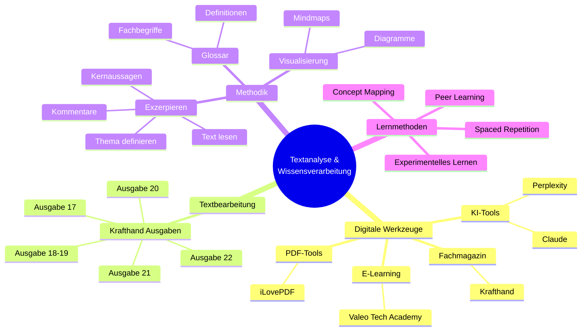
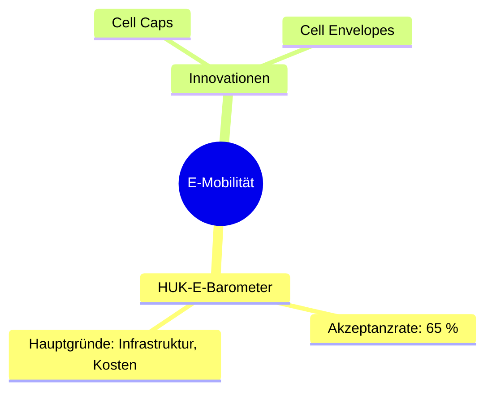

# **Methodik zur Textanalyse und Wissensverarbeitung**




## **Digitale Werkzeuge**
- **KI-Tools**: [Claude](https://claude.ai/new), [Perplexity](https://www.perplexity.ai/)
- **Fachmagazin**: [Krafthand](https://www.krafthand.de/) (inklusive [Ausgaben](https://www.krafthand.de/service/ausgaben/))
- **PDF-Tool**: [iLovePDF](https://www.ilovepdf.com/de/entsperren_pdf) (zum Bearbeiten von PDFs)
- **E-Learning**: [Valeo Tech Academy](https://www.valeo-techacademy.com/de/learn)

---

## **ToDo-Liste: Textbearbeitung**

### **Krafthand – ToDo-Übersicht**
#### **Ausgabe 22** (abgeschlossen)
- [x] HUK-E-Barometer zur E-Mobilität in Deutschland
- [x] Drive Pilot von Mercedes-Benz – Erweiterung auf 95 km/h
- [x] Spot-Repair in der Karosseriereparatur
- [x] VW Golf 7: Problemanalyse Tankklappe
- [x] Innovationen für HV-Batterien (Cell Caps und Cell Envelopes)

#### **Ausgabe 21** (in Bearbeitung)
- [ ] ADAC-Winterreifentest 2024: Sieger und Verlierer
- [ ] HV-Plattform PPE von Audi: Neue E-Auto-Plattform
- [ ] Check von GTÜ, ACE und ARBÖ: Ganzjahresreifen im Test
- [ ] Fahrerassistenzsysteme: Kalibrierung bei niedrigen Temperaturen
- [ ] Experteninterview zum Automatikgetriebeölwechsel
- [ ] Wettbewerbswidrige OBD-Sperren: Security Gateways

#### **Ausgabe 20**
- [x] LED-Nachrüstung von Halogenlampen
- [ ] Quietsch- und Knarzgeräusche bei vollem Lenkeinschlag

#### **Ausgabe 18-19**
- [ ] Batterietechnologie: Zellarten bei Cell-to-Pack
- [ ] Was bedeutet Cell-to-Pack?
- [ ] Umfrage bei 274 Kfz-Betrieben: Veränderungsbedarf in Werkstätten

#### **Ausgabe 17**
- [ ] Statische Batterieprüfung: E-Autobatterie in 15 Minuten testen
- [ ] Hygienerichtlinien für Fahrzeugklimaanlagen: Unsichtbare Gefahr
- [ ] Garantieverweigerung bei Wartungsmängeln
- [ ] Servicebedarf und Mischbarkeit von RDKS-Sensoren

---

## **Exzerpieren: Textanalyse und -zusammenfassung**

### **Vorgehen**
1. **Thema definieren**: Festlegen, welcher Text oder welche Fragestellung analysiert wird.
2. **Text lesen**: Überblickslektüre zur Identifikation zentraler Thesen und Argumente.
3. **Kernaussagen formulieren**: Prägnante Wiedergabe der Hauptaussagen.
4. **Eigene Kommentare ergänzen**: Kritische Reflexion und offene Fragen notieren.

### **Beispiel**
**Originaltext**:
*"Die Umstellung auf E-Mobilität könnte bis 2030 den CO2-Ausstoß um 40 % reduzieren."*

**Exzerpt**:
*"E-Mobilität: Potenzial zur CO2-Reduktion um 40 % bis 2030 (vgl. Müller 2024, S. 10)."*

**Eigene Anmerkung**:
*"Die Angabe berücksichtigt nicht die Emissionen der Batterieproduktion."*

---

## **Visuelle Unterstützung: Mindmaps**

- Erstellung zweier Mindmaps (strukturierte Liste)
  - Eine für Zahlen, Daten und Fakten
  - Eine für Fach- und Schlüsselwörter mit detaillierten Erklärungen

- Erstelle eine Mindmap in ASCII-Textform
- Erstelle eine Mindmap als Mermaid-Diagramm
- Erstelle eine Mindmap mit hellem Hintergrund
- Erstelle eine SVG-Darstellung der Mindmap, verwende ein hierarchisches Layout mit verschiedenen Farben und Formen
- Erstelle ein Flussdiagramm mit hellem Hintergrund


### **ASCII-Mindmap**
```plaintext
E-Mobilität
├── HUK-E-Barometer
│   ├── Akzeptanzrate 2024: 65 %
│   ├── Hauptgründe: Infrastruktur, Kosten
└── Innovationen
    ├── Cell Caps
    └── Cell Envelopes
```

### **Mermaid-Diagramm**


---

## Fachbegriff-Glossar

### Batterietechnologie
- **Cell-to-Pack (CTP)**: Technologie zur direkten Integration von Batteriezellen in das Batteriegehäuse, ohne separate Module.
- **Cell Caps**: Spezielle Abdeckungen für Batteriezellen zur Verbesserung der Sicherheit und Leistung.
- **Cell Envelopes**: Schutzhüllen für Batteriezellen, die zur Temperaturregulierung und mechanischen Stabilisierung beitragen.

### Fahrzeugsysteme
- **Drive Pilot**: Autonomes Fahrsystem von Mercedes-Benz für teilautomatisiertes Fahren.
- **RDKS-Sensoren**: Reifendruck-Kontrollsysteme zur kontinuierlichen Überwachung des Reifendrucks.
- **Security Gateway**: Sicherheitssystem zur Kontrolle und Beschränkung des Zugriffs auf Fahrzeugdaten.

### Wartung und Reparatur
- **Spot-Repair**: Reparaturmethode für kleinere Lackschäden mit minimalen Materialeinsatz.
- **HV-Plattform**: Hochvolt-Plattform für Elektrofahrzeuge.
- **Statische Batterieprüfung**: Testverfahren zur schnellen Diagnose von E-Auto-Batterien.

### Assistenzsysteme
- **Fahrerassistenzsysteme**: Elektronische Systeme zur Unterstützung des Fahrers.
- **Kalibrierung**: Einstellung und Abstimmung von Sensoren und Systemen für optimale Funktion.

_Hinweis: Dieses Glossar wird kontinuierlich erweitert und aktualisiert._

---

## **Latex**

- Prüfe Grammatik, Rechtschreibung, Klarheit, Prägnanz, Redundanz
- Erstelle Latex ohne Präambel

---

## **Fragenkatalog für Anki**

1. **Was ist Cell-to-Pack (CTP)?**
   - Antwort: Technologie zur direkten Integration von Batteriezellen ins Gehäuse.
2. **Welches Potenzial hat E-Mobilität laut Müller 2024?**
   - Antwort: CO2-Reduktion um 40 % bis 2030.
3. **Welche Vorteile bietet Spot-Repair?**
   - Antwort: Kosteneffizient bei kleinen Schäden, weniger Materialverbrauch.

---

## **Lernmethoden**

### **Methodenbeschreibung**
- **Concept Mapping**: Visualisierung von Zusammenhängen zwischen Fachbegriffen und Konzepten.
- **Spaced Repetition**: Wiederholung in gestaffelten Intervallen:
  - Tag 1, Tag 3, Tag 7, Tag 15, Tag 30.
- **Peer Learning**: Konzepte gegenseitig erklären, um Verständnis zu vertiefen.
- HISTORISCHE ENTWICKLUNG
- EXPERIMENTELLES LERNEN


##  Code

- Prüfe den Code
- Erstelle docstring und deutsche Kommentare
- Ertselle ein Code-Beschreibung
- Erkläre den Code

```python
"""
Modul zur Analyse von Fahrzeugdaten und Wartungsinformationen

Dieses Modul enthält Funktionen zur Verarbeitung und Analyse von:
- Batteriedaten
- Wartungsintervallen
- Diagnoseergebnissen
"""

class FahrzeugAnalyse:
    """Klasse zur Analyse von Fahrzeugdaten."""

    def __init__(self, fahrzeug_id):
        """
        Initialisiert die Fahrzeuganalyse.

        Args:
            fahrzeug_id (str): Eindeutige Fahrzeug-Identifikationsnummer
        """
        self.fahrzeug_id = fahrzeug_id
        self.wartungshistorie = []

    def batterie_analyse(self, messwerte):
        """
        Analysiert Batteriedaten und erstellt einen Diagnosebericht.

        Args:
            messwerte (dict): Dictionary mit Batteriekennwerten

        Returns:
            dict: Analyseergebnisse mit Handlungsempfehlungen
        """
        ergebnisse = {
            'status': self._bewerte_batteriezustand(messwerte),
            'empfehlungen': self._erstelle_empfehlungen(messwerte)
        }
        return ergebnisse

    def _bewerte_batteriezustand(self, messwerte):
        """
        Interne Methode zur Bewertung des Batteriezustands.

        Args:
            messwerte (dict): Batteriekennwerte

        Returns:
            str: Bewertung des Batteriezustands
        """
        # Implementierung der Bewertungslogik
        pass

# Beispiel für die Verwendung
if __name__ == "__main__":
    analyse = FahrzeugAnalyse("WDD1234567")
    testdaten = {
        'spannung': 380.5,
        'kapazität': 75.3,
        'temperatur': 25.4
    }
    ergebnis = analyse.batterie_analyse(testdaten)
    print(f"Analyseergebnis: {ergebnis}")
```


\newpage
## Erarbeitung und Vertiefung von Fachtexten

1. Erstellung einer Textanalyse

2. Erstellung eines Exzerpts (beachte exzerpieren-anweisung.md)

3. Erkläre

4. Erstellung eines Fragenkatalogs für Anki

5. Erstellung einer Bildanalyse

6. Erstellung zweier Mindmaps (strukturierte Liste)
   - Eine für Zahlen, Daten und Fakten
   - Eine für Fach- und Schlüsselwörter mit detaillierten Erklärungen

7. Kritische Reflexion

8. Fachbegriff-Glossar
   - Strukturierte Lernziele
   - Umfassendes Fachbegriff-Glossar
   - Kapitelzusammenfassungen

9. Erstelle mir die drei bis fünf wichtigsten Konzepte mit Erklärung

10. Lernmethoden
    - CONCEPT MAPPING UND VERNETZTES DENKEN
    - HISTORISCHE ENTWICKLUNG
    - EXPERIMENTELLES LERNEN
    - SYSTEMATISCHE WIEDERHOLUNG
      - Prinzip "spaced repetition" Konzepte in größeren Zeitabständen wiederholen
    - Peer Learning: Konzepte erklären
